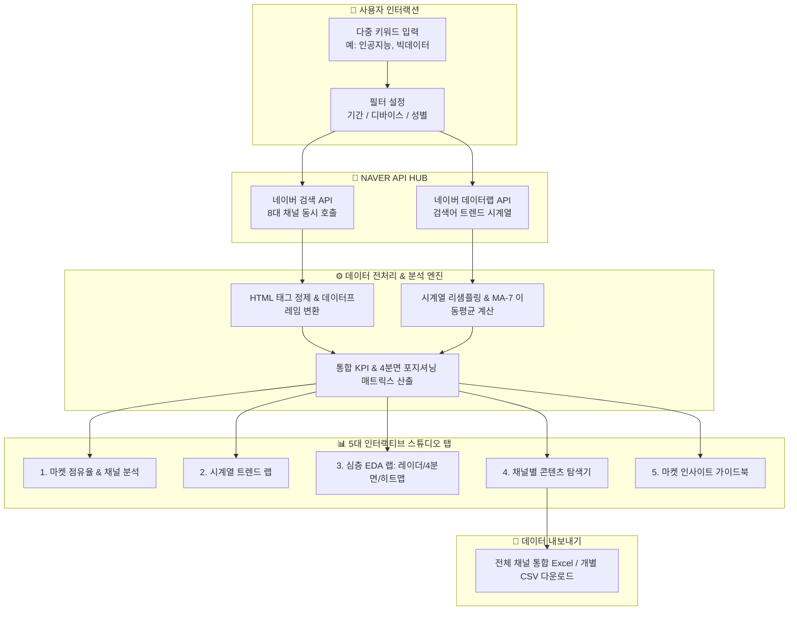

# ⚡ 네이버 마켓 인사이트 스튜디오 (Naver Market Insight Studio)

<div align="center">


<br/>

**네이버 공식 오픈 API(8대 채널)와 데이터랩 검색어 트렌드 API를 연동하여<br/>시장 트렌드와 미디어 채널 반응도를 실시간으로 교차 분석하는 올인원 탐색적 데이터 분석(EDA) 스튜디오입니다.**

</div>

---

## 🧭 아키텍처 & 데이터 흐름도



---

## 🌟 핵심 기능 및 5대 스튜디오 탭

### 1️⃣ 상단 글로벌 KPI 카드
* **총 콘텐츠 발행량**: 8개 채널 전체 누적 발행 규모 실시간 집계
* **트렌드 평균 지수**: 선택 기간 내 데이터랩 상대 검색 관심도 평균
* **최고 검색일**: 관심도가 가장 폭발했던 일자와 최대 지수 포착
* **1위 점유 채널**: 현재 키워드가 가장 활발하게 유통되는 메인 미디어 식별

---

### 2️⃣ 5대 전문 분석 탭 구성

| 탭 이름 | 핵심 시각화 & 기능 | 도출 가능한 인사이트 |
| :--- | :--- | :--- |
| **📊 1. 마켓 점유율 & 채널 분석** | • 8대 채널별 콘텐츠 발행량 바 차트<br/>• 키워드 간 미디어 점유율 도넛 차트 | 어떤 채널(블로그/뉴스 등)에 콘텐츠가 집중되어 있는지 공급 구조 파악 |
| **📈 2. 시계열 트렌드 랩** | • 인터랙티브 스플라인 시계열 차트<br/>• 7일 이동평균선(MA-7) 토글<br/>• 변동계수(CV) & 트렌드 안정성 지표 | 이벤트/시즌 이슈에 따른 대중 관심도 급증 시점 및 추세 변화 탐지 |
| **🔮 3. 심층 EDA 랩** | • **8채널 레이더 차트** (미디어 침투력)<br/>• **수요-공급 4분면 매트릭스** (관심도 vs 발행량)<br/>• **주간 검색 리듬 히트맵** (요일별 집중도) | 블루오션(고관심·저발행) 키워드 발굴 및 주간 최적 마케팅 타이밍 포착 |
| **🔎 4. 채널별 콘텐츠 탐색기** | • 8개 채널별 실제 검색 결과 카드형 탐색<br/>• 채널별 개별 CSV 내보내기<br/>• **전 채널 통합 다중 시트 Excel 보고서** | 원본 콘텐츠의 제목·요약문·링크를 직접 검증하고 보고서 파일로 저장 |
| **📖 5. 마켓 인사이트 가이드북** | • 소비자 의사결정 여정(CDJ) 인포그래픽<br/>• 채널별 마케팅 액션 프레임워크 | 탐색된 정량 데이터를 바탕으로 실무 마케팅 전략 수립 가이드 제공 |

---

## 📡 8대 분석 채널 (Multi-Channel Coverage)

```text
├── 📝 블로그 (Blog)       : 실제 이용자들의 생생한 후기와 경험 공유 데이터
├── ☕ 카페글 (Cafe)        : 특정 관심사 커뮤니티 기반의 심층 피드백 및 여론
├── 📰 뉴스 (News)          : 언론사 공식 보도 및 산업계 거시적 이슈 동향
├── 🌐 웹문서 (Web)         : 기업 공식 웹사이트, 기술 블로그 및 종합 정보
├── 💡 지식iN (Kin)         : 잠재 소비자가 직접 묻는 궁금증과 미해결 질문
├── 🖼️ 이미지 (Image)       : 비주얼 트렌드 및 제품/서비스 시각 자료
├── 📍 지역 (Local)         : 오프라인 매장, 스튜디오 및 지역 기반 비즈니스 거점
└── 📚 백과사전 (Encyc)     : 공식 개념 정의, 학술 및 표준 지식 데이터
```

---

## 📂 프로젝트 폴더 구조

```text
naver-search-dashboard/
├── 📄 app.py                      # 메인 Streamlit 대시보드 엔트리포인트
├── 📁 components/                 # UI 및 차트 모듈화 컴포넌트
│   ├── 📊 channel_analysis.py     # 8채널 비교 및 점유율 차트
│   ├── 📈 trend_charts.py         # 데이터랩 시계열 트렌드 & MA-7
│   ├── 🔮 advanced_analytics.py   # 레이더 차트, 4분면 매트릭스, 히트맵
│   ├── 🔎 result_explorer.py      # 원본 데이터 카드 및 엑셀/CSV 내보내기
│   ├── 💡 kpi_metrics.py          # 상단 글로벌 KPI 카드
│   ├── 📖 interpretation_guide.py # CDJ 해석 프레임워크 가이드
│   └── ⚙️ sidebar.py             # 필터 및 API 설정 사이드바
├── 📁 services/                   # 네이버 API 클라이언트 계층
│   ├── 📡 naver_search_client.py  # 8개 채널 검색 API 연동
│   └── 📈 naver_datalab_client.py # 데이터랩 검색어 트렌드 API 연동
├── 📁 config/                     # 환경 변수 및 공통 설정
│   └── ⚙️ settings.py             # API Key 및 엔드포인트 관리
├── 📁 utils/                      # 데이터 처리 및 헬퍼 함수
│   ├── 🧹 text_cleaner.py         # HTML 태그 제거 및 텍스트 정제
│   └── 🧮 data_helpers.py         # 엑셀 변환 및 포맷팅 유틸
├── 📄 requirements.txt            # Streamlit Cloud 웹 배포용 패키지 목록
├── 📄 pyproject.toml              # 프로젝트 의존성 설정 (uv)
└── 📄 .env.example                # 환경 변수 템플릿 파일
```

---

## 🚀 빠른 시작 (Local Setup)

### 1. 패키지 설치
```bash
# uv를 사용하는 경우 (추천)
uv sync

# 또는 pip를 사용하는 경우
pip install -r requirements.txt
```

### 2. 환경 변수 설정 (`.env`)
프로젝트 루트 디렉토리에 `.env` 파일을 생성하고 네이버 API 키를 입력합니다.
```env
NAVER_CLIENT_ID=your_naver_client_id
NAVER_CLIENT_SECRET=your_naver_client_secret
```

### 3. 대시보드 실행
```bash
uv run streamlit run app.py
```

---

## 🌐 Streamlit Community Cloud 웹 배포 방법

1. **[Streamlit Community Cloud](https://share.streamlit.io)** 에 GitHub 계정으로 로그인합니다.
2. **`Create app`** 버튼을 클릭합니다.
3. 설정을 입력합니다:
   * **Repository**: `wwlswnw/naver-search-dashboard`
   * **Branch**: `main`
   * **Main file path**: `app.py`
4. **`Advanced settings`** -> **`Secrets`** 에 네이버 API 키를 추가합니다:
   ```toml
   NAVER_CLIENT_ID = "발급받은_클라이언트_ID"
   NAVER_CLIENT_SECRET = "발급받은_클라이언트_시크릿"
   ```
5. **`Deploy!`** 버튼을 클릭하면 나만의 라이브 웹 대시보드가 완성됩니다!

---

<div align="center">
Made with ❤️ by wwlswnw
</div>
